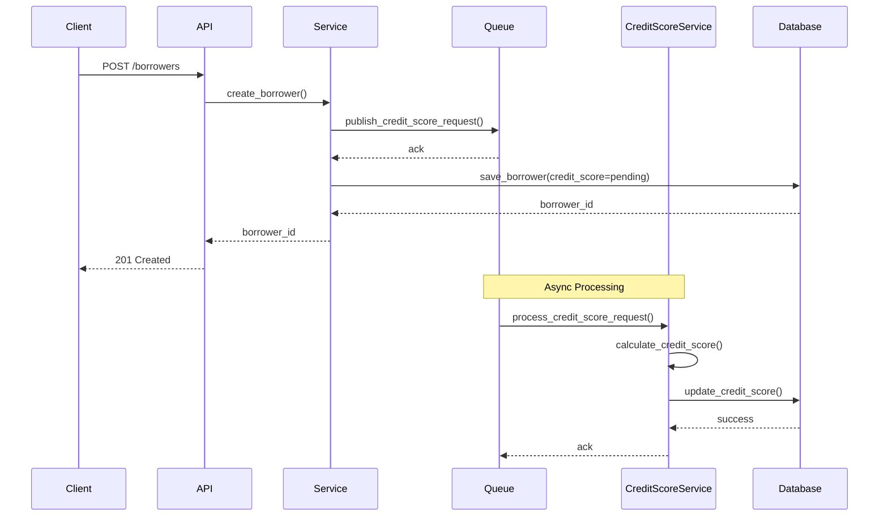

# Credit Score Integration Design

## Sequence Diagram

## Design Notes

1. **Asynchronous Processing**
   - Credit score calculation is moved to an asynchronous process
   - Initial borrower creation returns immediately with a pending credit score
   - Credit score is updated later via a background job

2. **Benefits**
   - Improved API response times
   - Better scalability for credit score calculations
   - Ability to retry failed calculations
   - Easier integration with external credit scoring services

3. **Implementation Considerations**
   - Use a message queue (e.g., RabbitMQ, Kafka) for credit score requests
   - Implement idempotency for credit score updates
   - Add monitoring for failed credit score calculations
   - Consider implementing a webhook for real-time credit score updates

4. **Testing Strategy**
   - Use monkeypatching to simulate external credit score service
   - Test both synchronous and asynchronous flows
   - Verify queue integration
   - Test error handling and retry mechanisms 