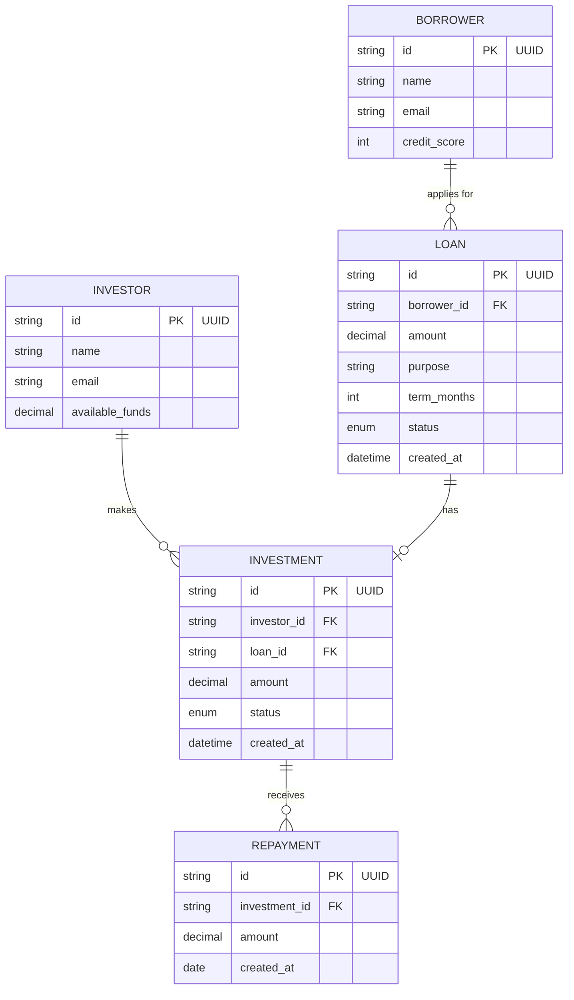
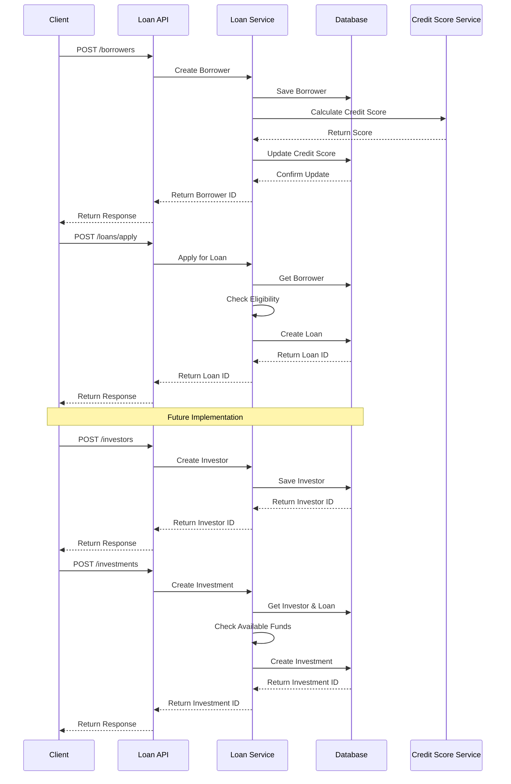

# Database Documentation

## Database Schema

## Link to mermaid
https://www.mermaidchart.com/raw/36676355-c490-4b11-949e-f36da5ea2289?theme=light&version=v0.1&format=svg

## Database Relationships

- A Borrower can have multiple Loans (one-to-many relationship)
- Each Loan belongs to exactly one Borrower
- An Investor can make multiple Investments (one-to-many relationship)
- Each Investment belongs to exactly one Investor
- A Loan can have one Investment (one-to-one relationship)
- An Investment can have multiple Repayments (one-to-many relationship)
- Each Repayment belongs to exactly one Investment

## Integration Sequence Diagram

## Notes

1. The database uses SQLAlchemy as the ORM
2. All database operations are performed through the repository pattern
3. The schema is designed to support:
   - Borrower management
   - Investor management
   - Loan applications
   - Investment tracking
   - Repayment tracking
   - Credit score tracking
   - Loan status tracking
4. Currently implemented features:
   - Borrower creation and management
   - Loan application process
5. Future features to be implemented:
   - Investor registration and management
   - Investment creation and tracking
   - Repayment processing
   - Loan status updates 